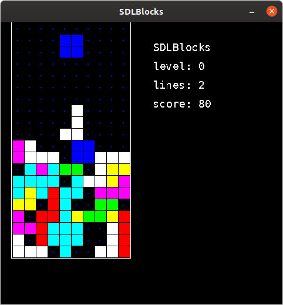

SDLBlocks by Don E. Llopis 2005 (llopis.don@gmail.com)

SDLBlocks is a remake of Tetris. It is written in C using libsdl.



The theme song Korobeiniki (the Peddlers) was downloaded from the
following wikipedia page: http://en.wikipedia.org/wiki/Korobeiniki

## How to build on an Ubuntu system

```
$ sudo apt install libsdl1.2-dev libsdl-ttf2.0-dev libsdl-mixer1.2-dev
$ make
```
